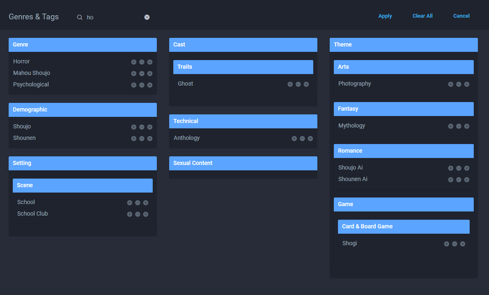

# Tag Management

### Tag Management

The tag list can be viewed at the bottom left of each entry page.  
  
Tags are not part of the submission system, but still very important. If you do submit any new entries, it would be massively appreciated if you could add tags once the entry is approved, marking some as spoilers if needed.  
  
Tags for each entry are entirely user-managed, with all users being able to add tags and vote on their relevance to the work in question. The results can then be filtered through in the ‘Browse’ section of the website.  
  
If you wish to submit a new tag, all you have to do is type in the name and submit - it’ll then be looked into and approved or denied.


The power of each users’ vote is limited to restrict abuse. If you feel that tags have been added incorrectly,  contact a [moderator](../moderator/moderator-list.md).


### Tag Requests

For the most part, all tags that users’ request are discussed between a few people before a decision on whether to include them or not is made. Ideally, tags should not be ones that are often considered subjective, such as 'moe',  and not as descriptive as eye colour. Browsing the list of tags is the best measure of seeing what type of content is approved.

### Tag List

Using the ‘Advanced genre & tag filtering’ button in the [Browse ](https://anilist.co/search/anime)section will give you a list of available tags, with descriptions on mouse hover.


A dedicated page in a table layout will be implemented at a later date.


